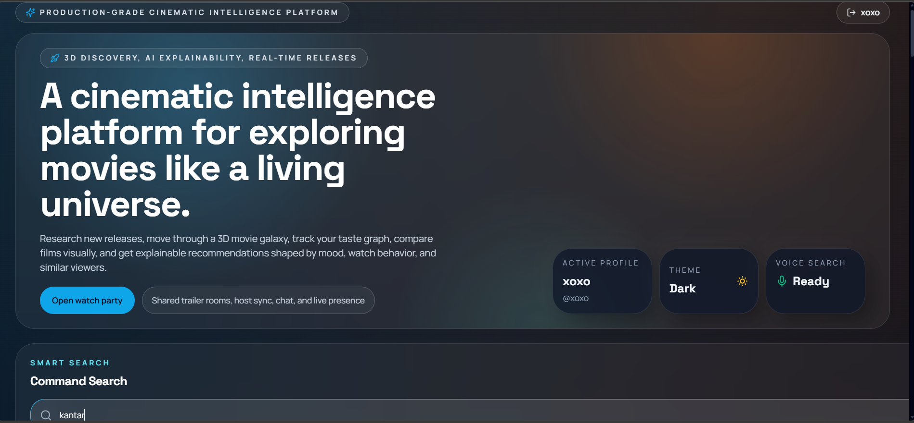
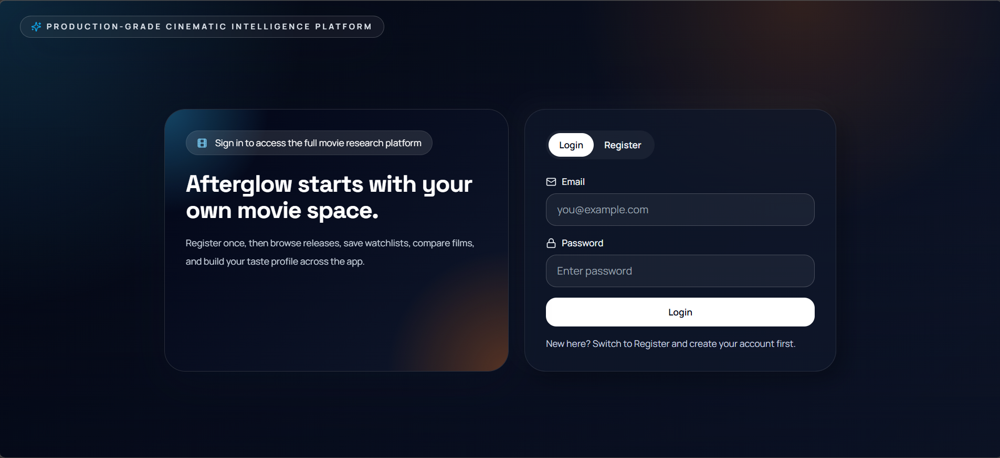
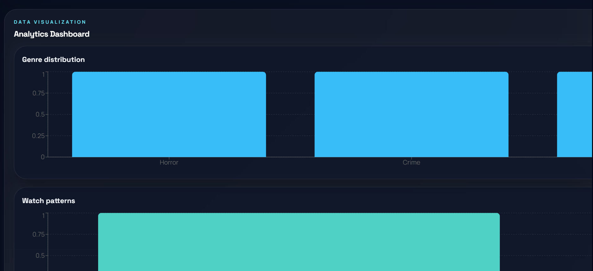
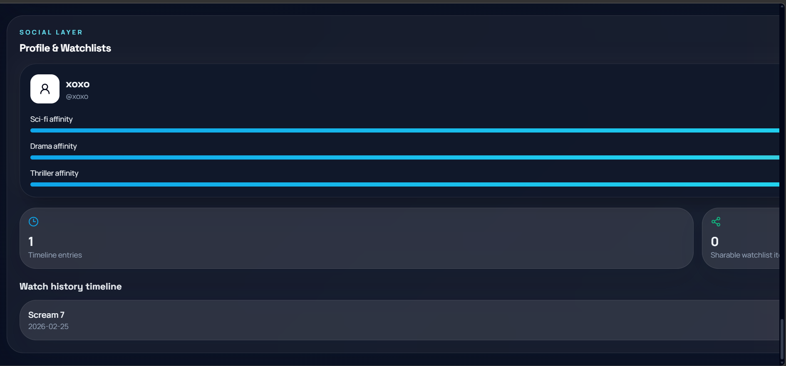

# 🎬 Movie Research & Recommendation App

A modern movie discovery platform that allows users to explore trending movies, search for titles, and view detailed information with an interactive and visually rich UI.

---

## 🚀 Live Demo  
👉 https://movie-research-app.vercel.app/

---

## 📸 Screenshots

### 🏠 Homepage


### 🎨 UI Experience


### 🔐 Login Page


### 📊 Analytics Dashboard


### 🧠 AI Features


---

## 🧠 Features

- 🔍 Real-time movie search  
- 🎬 Trending, Now Playing, and Upcoming movies  
- 🎥 Detailed movie information (ratings, overview, etc.)  
- 🎨 Modern UI with Tailwind CSS  
- 🌌 Interactive and immersive UI design  
- 📊 Analytics dashboard  
- ⚡ Fast and optimized performance  

---

## 🛠️ Tech Stack

**Frontend:**
- React.js  
- Tailwind CSS  
- Vite  

**Backend (Optional / Future Scope):**
- Node.js  
- Express  

**API:**
- TMDB (The Movie Database API)

---

## 📦 Installation

```bash
git clone https://github.com/AnshDwi/movie-research-app.git
cd movie-research-app
npm install
npm run dev